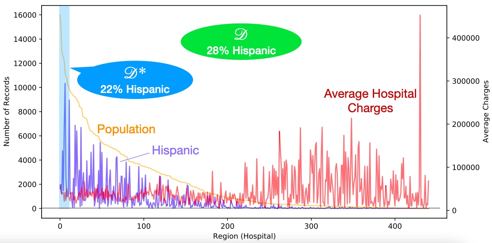

## [Jun 27, 2022] Vanilla Model Training

----

### Predicting *Hispanic* ethnicity on Texas-100X (I)

> **Threat Setting:**  
> Training distirbution is general data set distribution except the most populous hospitals.

> *<u>Adversarial Knowledge</u>:*

> - *High:* Adversary knows all but one record from training set.

> - *Medium:* Adversary knows the training distribution (i.e. can sample records with no intersection with training set)

> - *Low:* Adversary knows a skewed distribution (that has records from hospitals with highest number of patients)

**Figure 1:** Patient records distribution in Texas-100X, sorted with respect to hospital population.

#### Model uses *race* as a training feature

As reported in the paper draft, the model trained on Texas-100X data set uses the race attribute as a feature which could have a positive correlation with the ethnicity attribute. Regardless of this, it is still useful to compare the attribute inference attacks with the imputation (IP) attack in this setting.

    
**Hypothesis:** Passing WB$\cdot$IP as a feature to WB$\diamondsuit$IP's decision tree should improve the attack.

    **Remark:** The resulting WB$\square$IP attack does better, but only for the low adversarial knowledge setting where the adversary doesn't know the training distribution. Still for most cases, WB$\square$IP doesn't do better than WB$\cdot$IP.

    
**Hypothesis:** There should be no gap between attribute inference and imputation with knowledge of train set.

    **Remark:** Though there is a gap, this gap is reduced when imputation is trained with class label.

> WB$\cdot$IP multiplies the outputs of WB and IP  
> WB$\diamondsuit$IP uses a decision tree model to combine WB and IP  
> WB$\square$IP uses a decision tree model to combine WB, IP and WB$\cdot$IP  
> IP$^\dagger$ is the imputation with access to class label

| &nbsp;&nbsp;&nbsp;&nbsp;&nbsp;&nbsp;&nbsp;&nbsp;&nbsp;&nbsp;&nbsp;&nbsp;&nbsp;&nbsp;&nbsp;&nbsp; | High Adv (Train) | High Adv (Test) | Med Adv (Train) | Med Adv (Test) | Low Adv (Train) | Low Adv (Test) |
| :--- | :--- | :--- | :--- | :--- | :--- | :--- |
| Random | 28 $\pm$ 0 | 28 $\pm$ 0 | 28 $\pm$ 0 | 28 $\pm$ 0 | 28 $\pm$ 0 | 28 $\pm$ 0 |
| IP | 76 $\pm$ 2 | 74 $\pm$ 3 | 80 $\pm$ 2 | 80 $\pm$ 2 | 73 $\pm$ 3 | 75 $\pm$ 4 |
| IP$^\dagger$ | 80 $\pm$ 2 | 80 $\pm$ 2 | 80 $\pm$ 1 | 80 $\pm$ 3 | 72 $\pm$ 2 | 80 $\pm$ 2 |
| WB | 83 $\pm$ 3 | 85 $\pm$ 2 | 83 $\pm$ 5 | 84 $\pm$ 1 | 85 $\pm$ 3 | 86 $\pm$ 4 |
| WB$\cdot$IP | 88 $\pm$ 3 | 87 $\pm$ 4 | 84 $\pm$ 2 | 86 $\pm$ 4 | 87 $\pm$ 2 | 92 $\pm$ 2 |
| WB$\diamondsuit$IP | 81 $\pm$ 2 | 83 $\pm$ 3 | 82 $\pm$ 4 | 85 $\pm$ 5 | 72 $\pm$ 3 | 82 $\pm$ 4 |
| WB$\square$IP | 79 $\pm$ 5 | 85 $\pm$ 4 | 83 $\pm$ 2 | 83 $\pm$ 3 | 76 $\pm$ 4 | 85 $\pm$ 4 |
| WB$\cdot$IP$^\dagger$ | 87 $\pm$ 3 | 85 $\pm$ 4 | 84 $\pm$ 2 | 88 $\pm$ 2 | 86 $\pm$ 3 | 89 $\pm$ 1 |
| WB$\diamondsuit$IP$^\dagger$ | 84 $\pm$ 2 | 83 $\pm$ 4 | 82 $\pm$ 2 | 83 $\pm$ 5 | 68 $\pm$ 5 | 77 $\pm$ 5 |
| WB$\square$IP$^\dagger$ | 83 $\pm$ 1 | 82 $\pm$ 2 | 81 $\pm$ 3 | 86 $\pm$ 5 | 77 $\pm$ 4| 83 $\pm$ 3 |

**Table 1:** PPV (%) for predicting top-100 records on Texas-100X. Candidate set is drawn from general distribution.

#### Model doesn't have access to *race*

Here we study the impact of removing race from the model training. Since race and ethnicity have implicit correlation, it would be more realistic to assume the adversary trying to infer ethnicity would not know the race of the query record.

| &nbsp;&nbsp;&nbsp;&nbsp;&nbsp;&nbsp;&nbsp;&nbsp;&nbsp;&nbsp;&nbsp;&nbsp;&nbsp;&nbsp;&nbsp;&nbsp; | High Adv (Train) | High Adv (Test) | Med Adv (Train) | Med Adv (Test) | Low Adv (Train) | Low Adv (Test) |
| :--- | :--- | :--- | :--- | :--- | :--- | :--- |
| Random | 28 $\pm$ 0 | 28 $\pm$ 0 | 28 $\pm$ 0 | 28 $\pm$ 0 | 28 $\pm$ 0 | 28 $\pm$ 0 |
| IP | 41 $\pm$ 3 | 38 $\pm$ 1 | 43 $\pm$ 1 | 43 $\pm$ 2 | 39 $\pm$ 2 | 42 $\pm$ 3 |
| IP$^\dagger$ | 42 $\pm$ 2 | 43 $\pm$ 2 | 40 $\pm$ 4 | 44 $\pm$ 3 | 46 $\pm$ 2 | 46 $\pm$ 4 |
| WB | 47 $\pm$ 4 | 49 $\pm$ 4 | 46 $\pm$ 3 | 49 $\pm$ 2 | 45 $\pm$ 2 | 46 $\pm$ 6 |
| WB$\cdot$IP | 57 $\pm$ 2 | 55 $\pm$ 2 | 65 $\pm$ 2 | 63 $\pm$ 2 | 49 $\pm$ 1 | 55 $\pm$ 1 |
| WB$\diamondsuit$IP | 61 $\pm$ 6 | 55 $\pm$ 7 | 68 $\pm$ 3 | 64 $\pm$ 1 | 39 $\pm$ 3 | 54 $\pm$ 3 |
| WB$\square$IP | 62 $\pm$ 4 | 59 $\pm$ 8 | 64 $\pm$ 6 | 58 $\pm$ 6 | 43 $\pm$ 2 | 53 $\pm$ 3 |
| WB$\cdot$IP$^\dagger$ | 59 $\pm$ 2 | 57 $\pm$ 2 | 57 $\pm$ 2 | 60 $\pm$ 3 | 44 $\pm$ 1 | 56 $\pm$ 2 |
| WB$\diamondsuit$IP$^\dagger$ | 48 $\pm$ 5 | 51 $\pm$ 2 | 59 $\pm$ 9 | 56 $\pm$ 3 | 38 $\pm$ 3 | 55 $\pm$ 2 |
| WB$\square$IP$^\dagger$ | 43 $\pm$ 7 | 50 $\pm$ 4 | 57 $\pm$ 4 | 55 $\pm$ 5 | 38 $\pm$ 2 | 56 $\pm$ 1 |

**Table 2:** PPV (%) for predicting top-100 records on Texas-100X. Candidate set is drawn from general distribution.

**Remark:** From the results in Table 2, we can see the impact of removing race attribute on ethnicity inference. The imputation PPV drops from ~80% to ~40%.

### Predicting *Hispanic* ethnicity on Texas-100X (II)

Here we consider the scenario where the training data comes from skewed distribution, while an adversary (in low adversarial knowledge setting) might have access to the general pupulation distribution.

> **Threat Setting:**  
> Training distirbution is a skewed distribution limited to records from most populous hospitals.

> *<u>Adversarial Knowledge</u>:*

> - *High:* Adversary knows all but one record from training set.

> - *Medium:* Adversary knows the training distribution (i.e. can sample records with no intersection with training set)

> - *Low:* Adversary knows the general data set distribution except the most populous hospitals.

#### Model uses *race* as a training feature

| &nbsp;&nbsp;&nbsp;&nbsp;&nbsp;&nbsp;&nbsp;&nbsp;&nbsp;&nbsp;&nbsp;&nbsp;&nbsp;&nbsp;&nbsp;&nbsp; | High Adv (Train) | High Adv (Test) | Med Adv (Train) | Med Adv (Test) | Low Adv (Train) | Low Adv (Test) |
| :--- | :--- | :--- | :--- | :--- | :--- | :--- |
| Random | 22 $\pm$ 0 | 22 $\pm$ 0 | 22 $\pm$ 0 | 22 $\pm$ 0 | 22 $\pm$ 0 | 22 $\pm$ 0 |
| IP | 89 $\pm$ 3 | 88 $\pm$ 3 | 92 $\pm$ 2 | 93 $\pm$ 2 | 83 $\pm$ 2 | 74 $\pm$ 4 |
| IP$^\dagger$ | 88 $\pm$ 1 | 85 $\pm$ 2 | 83 $\pm$ 4 | 88 $\pm$ 3 | 77 $\pm$ 2 | 75 $\pm$ 3 |
| WB | 87 $\pm$ 6 | 91 $\pm$ 5 | 89 $\pm$ 4 | 93 $\pm$ 3 | 94 $\pm$ 4 | 91 $\pm$ 3 |
| WB$\cdot$IP | 96 $\pm$ 1 | 95 $\pm$ 2 | 97 $\pm$ 2 | 95 $\pm$ 1 | 90 $\pm$ 2 | 88 $\pm$ 3 |
| WB$\diamondsuit$IP | 94 $\pm$ 1 | 88 $\pm$ 1 | 91 $\pm$ 3 | 90 $\pm$ 2 | 86 $\pm$ 7 | 84 $\pm$ 5 |
| WB$\square$IP | 97 $\pm$ 1 | 91 $\pm$ 3 | 94 $\pm$ 2 | 91 $\pm$ 2 | 91 $\pm$ 3 | 88 $\pm$ 6 |
| WB$\cdot$IP$^\dagger$ | 96 $\pm$ 1 | 95 $\pm$ 3 | 96 $\pm$ 2 | 95 $\pm$ 2 | 91 $\pm$ 2 | 86 $\pm$ 2 |
| WB$\diamondsuit$IP$^\dagger$ | 95 $\pm$ 2 | 88 $\pm$ 3 | 95 $\pm$ 1 | 92 $\pm$ 2 | 87 $\pm$ 6 | 82 $\pm$ 5 |
| WB$\square$IP$^\dagger$ | 97 $\pm$ 1 | 93 $\pm$ 4 | 95 $\pm$ 2 | 92 $\pm$ 1 | 89 $\pm$ 2 | 84 $\pm$ 6 |

**Table 3:** PPV (%) for predicting top-100 records on Texas-100X. Candidate set is drawn from *skewed* distribution.

**Remark:** As shown in Table 3, IP$^\dagger$ performs slightly worse than IP. Hence the class label seems to have a negative correlation with the Hispanic ethnicity in this setting where training records come from a skewed distribution.

#### Model doesn't have access to *race*

| &nbsp;&nbsp;&nbsp;&nbsp;&nbsp;&nbsp;&nbsp;&nbsp;&nbsp;&nbsp;&nbsp;&nbsp;&nbsp;&nbsp;&nbsp;&nbsp; | High Adv (Train) | High Adv (Test) | Med Adv (Train) | Med Adv (Test) | Low Adv (Train) | Low Adv (Test) |
| :--- | :--- | :--- | :--- | :--- | :--- | :--- |
| Random | 22 $\pm$ 0 | 22 $\pm$ 0 | 22 $\pm$ 0 | 22 $\pm$ 0 | 22 $\pm$ 0 | 22 $\pm$ 0 |
| IP | 67 $\pm$ 3 | 68 $\pm$ 3 | 64 $\pm$ 4 | 69 $\pm$ 5 | 41 $\pm$ 5 | 45 $\pm$ 4 |
| IP$^\dagger$ | 71 $\pm$ 5 | 64 $\pm$ 2 | 64 $\pm$ 3 | 61 $\pm$ 1 | 47 $\pm$ 2 | 44 $\pm$ 6 |
| WB | 53 $\pm$ 6 | 55 $\pm$ 4 | 53 $\pm$ 6 | 56 $\pm$ 4 | 51 $\pm$ 4 | 54 $\pm$ 5 |
| WB$\cdot$IP | 86 $\pm$ 1 | 87 $\pm$ 1 | 91 $\pm$ 1 | 91 $\pm$ 2 | 64 $\pm$ 2 |  70 $\pm$ 2|
| WB$\diamondsuit$IP | 86 $\pm$ 1 | 84 $\pm$ 4 | 89 $\pm$ 1 | 84 $\pm$ 2 | 61 $\pm$ 6 | 60 $\pm$ 8 |
| WB$\square$IP | 87 $\pm$ 3 | 85 $\pm$ 4 | 90 $\pm$ 1 | 87 $\pm$ 2 | 59 $\pm$ 8 | 56 $\pm$ 3 |
| WB$\cdot$IP$^\dagger$ | 80 $\pm$ 3 | 82 $\pm$ 1 | 85 $\pm$ 2 | 86 $\pm$ 1 | 60 $\pm$ 4 |  64 $\pm$ 3|
| WB$\diamondsuit$IP$^\dagger$ | 83 $\pm$ 1 | 86 $\pm$ 2 | 87 $\pm$ 3 | 84 $\pm$ 2 | 59 $\pm$ 7 | 64 $\pm$ 8 |
| WB$\square$IP$^\dagger$ | 83 $\pm$ 1 | 85 $\pm$ 1 | 88 $\pm$ 1 | 85 $\pm$ 1 | 57 $\pm$ 7 | 62 $\pm$ 6 |

**Table 4:** PPV (%) for predicting top-100 records on Texas-100X. Candidate set is drawn from *skewed* distribution.

**Remark:** Similar to previous case, race's correlation to ethnicity has a huge impact on the inference task.

### Comments

